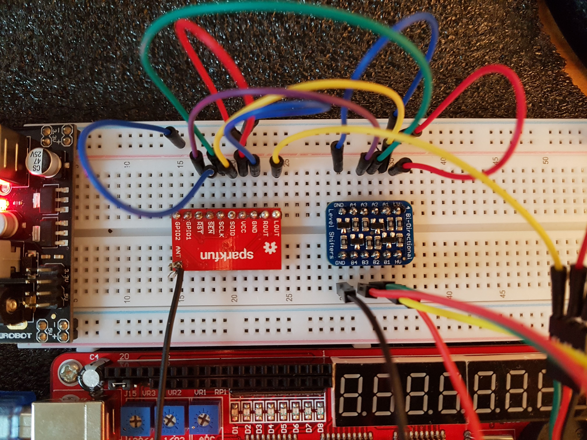
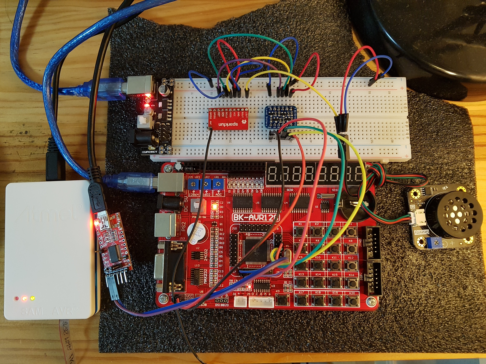

# AVR_SI4703
This is a SI4703 FM Tuner Library for AVR(ATmega128A) 
https://blog.naver.com/eziya76

Reference : https://github.com/mathertel/Radio 
Si4703 breakout : https://www.sparkfun.com/products/11083 
Evaluation board : BK-128AVR (ATmega128A) 
Logic level shifter : https://www.adafruit.com/product/757 
Amplifier + Speaker : https://www.dfrobot.com/product-1401.html

[ My experiences ]
1) Logic level shifter is mandatory as Si4703 I2C level is 3.3V 
2) Set SEN pin as HIGH when communication is initialized for I2C. 
3) Amplifier + Speaker is needed for LOUT or ROUT 

 
 
